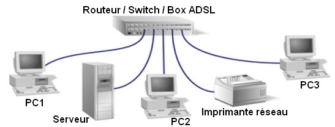

# Resumé de cours - Serveurs et reseaux locaux 

## Prérequis 
- Intaller un IDE , à savoir Thonny ou vscode (avec l'extension python)

## Reseau local 

- Un réseau local (LAN, Local Area Network) désigne un groupe d'appareils informatiques connectés au sein d'une zone localisée et partageant généralement une connexion Internet centralisée

## Serveurs 

Un serveur informatique offre des services accessibles via un réseau. Il peut être matériel ou logiciel, c’est un ordinateur qui exécute des opérations suivant les requêtes effectuées par un autre ordinateur appelé « client ». C’est pourquoi on entend souvent parler de relation « client/serveur ». 

### IP et Port 

- L'adresse IP sert  à identifier de façon unique un ordinateur sur le réseau tandis que le numéro de port identifie l'application qui tourne sur un serveur 

### Serveur Web - HTTP 

- un serveur web est un ordinateur qui stocke les fichiers qui composent un site web (par exemple les documents HTML, les images, les feuilles de style CSS, les fichiers JavaScript) et qui les envoie à l'appareil de l'utilisateur qui visite le site. Cet ordinateur est connecté à Internet en general et accessible depuis un nom de domaine . 
  
- Un nom de domaine est la traduction d'une adresse IP en une suite de caractères facile à retenir  accéder à un site web en general. 

### Serveur DNS

- Les serveurs DNS traduisent des demandes de noms en adresses IP, en contrôlant à quel serveur un utilisateur final va se connecter quand il tapera un nom de domaine dans son navigateur.

